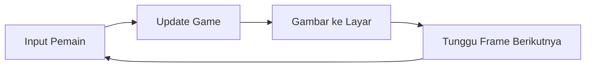
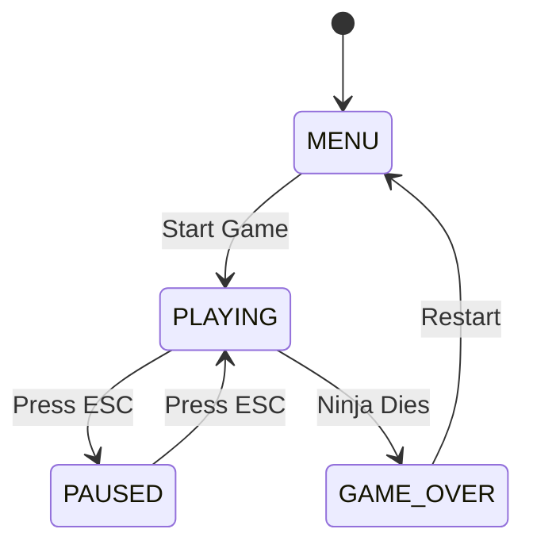

# 🎮 Mekanik Game Shinombie - Cara Kerja Game

## 🌟 Pengantar: Bagaimana Game Bekerja?

Halo teman-teman! Pernahkah kalian bertanya-tanya bagaimana game Shinombie bisa berjalan dengan lancar? Bagaimana ninja bisa bergerak, zombie bisa mengejar, dan efek-efek keren bisa muncul? Mari kita pelajari "mesin" di balik game ini! 🚀

## 🔄 1. Game Loop - Jantung Game

### 🔍 Apa itu Game Loop?
Game Loop adalah **jantung** dari setiap game! Seperti jantung yang berdetak terus-menerus, game loop berjalan berulang-ulang untuk membuat game terlihat hidup.

### 🎯 Siklus Game Loop:


### 🎮 Contoh Game Loop:
```python
while game_running:
    # 1. Tangani input pemain
    handle_input()  # Tombol yang ditekan?
    
    # 2. Update semua objek
    update_ninja()   # Gerakkan ninja
    update_zombies() # Gerakkan zombie
    update_effects() # Update efek visual
    
    # 3. Gambar semuanya
    draw_background() # Gambar latar belakang
    draw_ninja()      # Gambar ninja
    draw_zombies()    # Gambar zombie
    draw_effects()    # Gambar efek
    
    # 4. Tunggu frame berikutnya
    clock.tick(60)    # 60 FPS (Frame Per Second)
```

### 🧮 Perhitungan FPS:
```
FPS = Frame Per Second = Berapa kali layar di-update per detik
60 FPS = Layar di-update 60 kali dalam 1 detik
1 Frame = 1/60 detik = 0.0167 detik
```

## 🥷 2. Sistem Kontrol Ninja

### 🔍 Input Handling (Menangani Masukan):
Sistem ini "mendengarkan" tombol apa yang ditekan pemain.

### 🎯 Pemetaan Kontrol:
```python
# Kontrol ninja
keys = pygame.key.get_pressed()

if keys[pygame.K_LEFT]:     # Panah kiri
    ninja.move_left()
if keys[pygame.K_RIGHT]:    # Panah kanan
    ninja.move_right()
if keys[pygame.K_SPACE]:    # Spasi
    ninja.jump()
if keys[pygame.K_x]:        # Tombol X
    ninja.attack()
```

### 🏃 Sistem Gerakan:
```python
class Ninja:
    def move_left(self):
        self.x -= self.speed  # Kurangi posisi x
        self.facing_left = True
    
    def move_right(self):
        self.x += self.speed  # Tambah posisi x
        self.facing_left = False
    
    def jump(self):
        if self.on_ground:  # Hanya bisa lompat kalau di tanah
            self.velocity_y = -self.jump_power
            self.on_ground = False
```

## 🧟 3. Sistem AI Zombie

### 🔍 Artificial Intelligence (Kecerdasan Buatan):
Zombie punya "otak" sederhana yang membuat mereka bisa mengejar ninja!

### 🎯 Algoritma Pathfinding:
```python
class Zombie:
    def update_ai(self):
        # 1. Cari posisi ninja
        ninja_x = self.game.ninja.x
        ninja_y = self.game.ninja.y
        
        # 2. Hitung arah ke ninja
        dx = ninja_x - self.x
        dy = ninja_y - self.y
        
        # 3. Bergerak ke arah ninja
        if dx > 0:  # Ninja di kanan
            self.x += self.speed
        elif dx < 0:  # Ninja di kiri
            self.x -= self.speed
        
        # 4. Serang jika dekat
        distance = math.sqrt(dx*dx + dy*dy)
        if distance < 50:  # Dalam jarak serang
            self.attack_ninja()
```

### 🧮 Perhitungan Jarak:
```
Jarak = √[(x₂-x₁)² + (y₂-y₁)²]

Contoh:
Ninja di (100, 200), Zombie di (150, 250)
Jarak = √[(150-100)² + (250-200)²]
      = √[50² + 50²]
      = √[2500 + 2500]
      = √5000 ≈ 70.7 pixel
```

## 💥 4. Sistem Collision Detection (Deteksi Tabrakan)

### 🔍 Mengapa Penting?
Tanpa deteksi tabrakan, ninja bisa berjalan menembus zombie, kunai tidak bisa mengenai target!

### 🎯 Jenis-Jenis Collision:

#### A. Rectangle Collision (Kotak):
```python
def check_rect_collision(rect1, rect2):
    return (rect1.x < rect2.x + rect2.width and
            rect1.x + rect1.width > rect2.x and
            rect1.y < rect2.y + rect2.height and
            rect1.y + rect1.height > rect2.y)
```

#### B. Circle Collision (Lingkaran):
```python
def check_circle_collision(obj1, obj2, radius1, radius2):
    dx = obj1.x - obj2.x
    dy = obj1.y - obj2.y
    distance = math.sqrt(dx*dx + dy*dy)
    return distance < (radius1 + radius2)
```

### 🧮 Contoh Perhitungan:
```
Ninja: x=50, y=100, width=30, height=40
Zombie: x=70, y=110, width=30, height=40

Cek collision:
- 50 < 70+30 = 50 < 100 ✓
- 50+30 > 70 = 80 > 70 ✓
- 100 < 110+40 = 100 < 150 ✓
- 100+40 > 110 = 140 > 110 ✓

Semua kondisi terpenuhi = COLLISION! 💥
```

## 🎨 5. Sistem Animasi

### 🔍 Cara Kerja Animasi:
Animasi adalah rangkaian gambar yang ditampilkan secara berurutan dengan cepat, seperti flipbook!

### 🎯 Frame Animation:
```python
class AnimatedSprite:
    def __init__(self):
        self.frames = []  # Daftar gambar animasi
        self.current_frame = 0
        self.animation_speed = 0.2
        self.animation_timer = 0
    
    def update_animation(self):
        self.animation_timer += self.animation_speed
        
        if self.animation_timer >= 1.0:
            self.current_frame += 1
            self.animation_timer = 0
            
            # Kembali ke frame pertama jika sudah habis
            if self.current_frame >= len(self.frames):
                self.current_frame = 0
```

### 🧮 Perhitungan Kecepatan Animasi:
```
Animation Speed = 0.2
FPS = 60

Waktu per frame animasi = 1.0 / 0.2 = 5 frame game
Dalam detik = 5 / 60 = 0.083 detik per frame animasi
```

## 🌦️ 6. Sistem Efek Visual

### 🔍 Particle System (Sistem Partikel):
Efek seperti hujan, darah, dan ledakan menggunakan banyak partikel kecil!

### 🎯 Contoh Sistem Hujan:
```python
class RainEffect:
    def __init__(self):
        self.raindrops = []
    
    def create_raindrop(self):
        raindrop = {
            'x': random.randint(0, SCREEN_WIDTH),
            'y': -10,  # Mulai dari atas layar
            'speed': random.randint(5, 15),
            'length': random.randint(10, 20)
        }
        self.raindrops.append(raindrop)
    
    def update_rain(self):
        for drop in self.raindrops:
            drop['y'] += drop['speed']  # Jatuh ke bawah
            
            # Hapus jika sudah keluar layar
            if drop['y'] > SCREEN_HEIGHT:
                self.raindrops.remove(drop)
```

### 🧮 Perhitungan Intensitas Hujan:
```
Jumlah tetes per detik = 100
FPS = 60
Tetes per frame = 100 / 60 ≈ 1.67

Setiap frame, buat 1-2 tetes hujan baru
```

## 🎵 7. Sistem Audio

### 🔍 Manajemen Suara:
Game punya banyak suara yang harus diatur dengan baik!

### 🎯 Jenis-Jenis Audio:

#### A. Sound Effects (SFX):
```python
class SoundManager:
    def __init__(self):
        self.sounds = {
            'jump': pygame.mixer.Sound('jump.wav'),
            'attack': pygame.mixer.Sound('attack.wav'),
            'zombie_growl': pygame.mixer.Sound('growl.wav')
        }
    
    def play_sound(self, sound_name):
        if sound_name in self.sounds:
            self.sounds[sound_name].play()
```

#### B. Background Music:
```python
def play_background_music(self, music_file):
    pygame.mixer.music.load(music_file)
    pygame.mixer.music.play(-1)  # Loop forever
    pygame.mixer.music.set_volume(0.5)  # 50% volume
```

### 🧮 Perhitungan Volume:
```
Volume Range: 0.0 - 1.0
0.0 = Tidak ada suara (0%)
0.5 = Setengah volume (50%)
1.0 = Volume penuh (100%)
```

## 🏆 8. Sistem Scoring dan Level

### 🔍 Manajemen Score:
Sistem yang menghitung poin pemain berdasarkan aksi dalam game.

### 🎯 Perhitungan Score:
```python
class ScoreManager:
    def __init__(self):
        self.score = 0
        self.multiplier = 1
    
    def add_score(self, points, action_type):
        if action_type == 'kill_zombie':
            base_points = 100
        elif action_type == 'kill_boss':
            base_points = 500
        elif action_type == 'combo':
            self.multiplier += 0.5
        
        final_points = base_points * self.multiplier
        self.score += final_points
```

### 🧮 Contoh Perhitungan:
```
Kill zombie = 100 poin
Multiplier = 1.5x (dari combo)
Final score = 100 × 1.5 = 150 poin
```

## 🎮 9. State Management (Manajemen Status)

### 🔍 Game States:
Game punya berbagai "keadaan" seperti menu, bermain, pause, game over.

### 🎯 State Machine:
```python
class GameStateManager:
    def __init__(self):
        self.current_state = 'MENU'
        self.states = {
            'MENU': MenuState(),
            'PLAYING': PlayingState(),
            'PAUSED': PausedState(),
            'GAME_OVER': GameOverState()
        }
    
    def change_state(self, new_state):
        self.current_state = new_state
    
    def update(self):
        self.states[self.current_state].update()
```

### 🔄 Transisi State:


## 🔧 10. Optimasi Performance

### 🔍 Mengapa Optimasi Penting?
Agar game berjalan lancar tanpa lag, terutama saat ada banyak objek!

### 🎯 Teknik Optimasi:

#### A. Object Pooling:
```python
class ObjectPool:
    def __init__(self, object_type, pool_size):
        self.pool = [object_type() for _ in range(pool_size)]
        self.active_objects = []
    
    def get_object(self):
        if self.pool:
            obj = self.pool.pop()
            self.active_objects.append(obj)
            return obj
        return None
    
    def return_object(self, obj):
        if obj in self.active_objects:
            self.active_objects.remove(obj)
            obj.reset()  # Reset ke kondisi awal
            self.pool.append(obj)
```

#### B. Culling (Tidak Gambar yang Tidak Terlihat):
```python
def should_draw_object(obj, camera):
    # Hanya gambar jika objek terlihat di layar
    return (obj.x + obj.width > camera.x and
            obj.x < camera.x + SCREEN_WIDTH and
            obj.y + obj.height > camera.y and
            obj.y < camera.y + SCREEN_HEIGHT)
```

### 🧮 Perhitungan Efisiensi:
```
Tanpa optimasi: 1000 objek × 60 FPS = 60,000 operasi/detik
Dengan culling: 100 objek terlihat × 60 FPS = 6,000 operasi/detik
Peningkatan: 60,000 / 6,000 = 10x lebih cepat!
```

## 🎯 11. Sistem Save/Load

### 🔍 Menyimpan Progress:
Agar pemain tidak kehilangan progress saat keluar game!

### 🎯 Format Data:
```python
import json

class SaveManager:
    def save_game(self, player_data):
        save_data = {
            'player_name': player_data.name,
            'high_score': player_data.high_score,
            'level_reached': player_data.level,
            'settings': {
                'volume': player_data.volume,
                'difficulty': player_data.difficulty
            }
        }
        
        with open('savegame.json', 'w') as f:
            json.dump(save_data, f)
    
    def load_game(self):
        try:
            with open('savegame.json', 'r') as f:
                return json.load(f)
        except FileNotFoundError:
            return self.create_default_save()
```

## 🎮 12. Sistem Difficulty Scaling

### 🔍 Penyesuaian Kesulitan:
Game menjadi lebih sulit seiring waktu untuk tetap menantang!

### 🎯 Formula Scaling:
```python
class DifficultyManager:
    def calculate_zombie_stats(self, level):
        base_health = 100
        base_speed = 2
        base_spawn_rate = 0.02
        
        # Kesulitan meningkat 10% setiap level
        multiplier = 1 + (level * 0.1)
        
        return {
            'health': int(base_health * multiplier),
            'speed': base_speed * multiplier,
            'spawn_rate': min(base_spawn_rate * multiplier, 0.1)
        }
```

### 🧮 Contoh Perhitungan Level 5:
```
Base health = 100
Level = 5
Multiplier = 1 + (5 × 0.1) = 1.5

Zombie health = 100 × 1.5 = 150
Zombie speed = 2 × 1.5 = 3
```

## 🏆 Kesimpulan: Mekanik yang Bekerja Bersama

Wah, ternyata banyak sekali sistem yang bekerja di balik layar untuk membuat game Shinombie berjalan dengan lancar! Semua mekanik ini bekerja sama seperti orkestra yang harmonis.

### 🌟 Sistem Utama yang Sudah Kita Pelajari:

1. **Game Loop** - Jantung yang membuat game hidup
2. **Input System** - Mendengarkan perintah pemain
3. **AI System** - Membuat zombie "pintar"
4. **Collision Detection** - Deteksi tabrakan
5. **Animation System** - Membuat karakter bergerak
6. **Particle Effects** - Efek visual yang keren
7. **Audio System** - Manajemen suara
8. **Scoring System** - Menghitung poin
9. **State Management** - Mengatur status game
10. **Performance Optimization** - Membuat game lancar
11. **Save/Load System** - Menyimpan progress
12. **Difficulty Scaling** - Menyesuaikan tantangan

### 🎯 Pelajaran Penting:

1. **Modularitas** 🧩
   - Setiap sistem punya tugas spesifik
   - Mudah diperbaiki dan dikembangkan

2. **Efisiensi** ⚡
   - Optimasi membuat game berjalan lancar
   - Penting untuk pengalaman pemain yang baik

3. **User Experience** 😊
   - Semua sistem dirancang untuk kesenangan pemain
   - Feedback yang jelas dan responsif

4. **Skalabilitas** 📈
   - Sistem bisa berkembang seiring waktu
   - Mudah menambah fitur baru

### 🚀 Tips untuk Pengembang Muda:

1. **Mulai Sederhana** 🌱
   - Buat sistem dasar dulu, baru tambah kompleksitas

2. **Test Sering** 🧪
   - Selalu test setiap perubahan
   - Cari bug sebelum menambah fitur baru

3. **Dokumentasi** 📝
   - Tulis komentar yang jelas
   - Buat dokumentasi untuk sistem kompleks

4. **Belajar dari Game Lain** 🎮
   - Mainkan game lain dan analisis mekaniknya
   - Pelajari apa yang membuat game itu menyenangkan

5. **Iterasi** 🔄
   - Perbaiki terus-menerus
   - Dengarkan feedback pemain

Ingat, membuat game adalah seni dan sains sekaligus! Dengan memahami mekanik-mekanik ini, kalian sudah selangkah lebih dekat menjadi game developer yang hebat! 🌟

Keep coding, keep creating, and most importantly, keep having fun! 🎮✨

---

*"Game yang bagus bukan hanya tentang grafik yang cantik, tapi tentang mekanik yang solid dan menyenangkan untuk dimainkan!"* 🎯